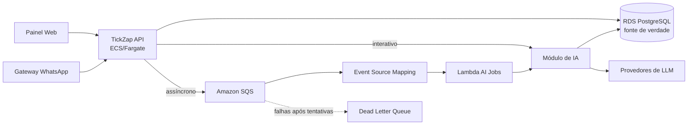

# Arquitetura de IA do TickZap

**Status:** decisão arquitetural vigente  
**Data:** 12/07/2026

## Contexto

O TickZap é um monorepo com uma API Hono/Bun em `apps/api` e um frontend Vue em `apps/web`. A implementação de IA
começou separadamente em `apps/ai`, mas ainda não possui funcionalidades ou dados em produção que exijam a manutenção
de um serviço independente.

Esta decisão substitui, como direção arquitetural, a proposta de manter a IA como uma segunda API com cópias de
tickets, conversas e tenants. Os documentos anteriores continuam úteis como material de pesquisa e implementação do AI
SDK, mas não definem mais os limites entre os serviços.

## Decisão

A IA será implementada como um domínio interno do monólito em `apps/api`.

- A API principal será a única API pública.
- A API principal será a fonte de verdade dos dados de negócio.
- Capacidades interativas de IA serão chamadas diretamente por funções internas.
- Processamentos assíncronos serão publicados no Amazon SQS e executados inicialmente por AWS Lambda.
- Não haverá um worker permanentemente ativo enquanto não existir uma carga que justifique ECS/Fargate.
- Não serão introduzidos Kafka, RabbitMQ, Kubernetes ou um banco exclusivo da IA sem necessidade concreta.

Monólito, neste contexto, descreve a propriedade do domínio e do código. A API HTTP e as funções Lambda podem ser
artefatos e processos de execução diferentes sem transformar a IA em um microsserviço independente.

## Visão geral



## Propriedade dos dados

A API principal é proprietária de:

- tenants e usuários;
- canais e contatos;
- tickets e mensagens;
- agentes configurados pelo cliente;
- aprovações humanas e respostas enviadas;
- documentos e configurações da base de conhecimento;
- permissões e auditoria de produto.

O domínio de IA pode armazenar dados técnicos próprios, no mesmo PostgreSQL:

- execuções de IA, status e erros;
- modelo e versão de prompt utilizados;
- consumo de tokens, latência e custo;
- sugestões geradas e sua aprovação ou rejeição;
- chunks e embeddings da base de conhecimento;
- avaliações técnicas dos resultados.

Não serão criadas tabelas paralelas de tickets, mensagens ou tenants para a IA. Uma execução referencia a entidade
original e pode guardar somente o snapshot mínimo necessário para auditoria e reprodutibilidade.

## Organização do domínio de IA

O domínio será organizado por capacidade de produto, e não por camadas técnicas genéricas.

```text
apps/api/src/modules/ai/
├── suggestions/
│   ├── generate-suggestion.ts
│   ├── suggestion.schema.ts
│   └── suggestion.prompt.ts
├── triage/
│   ├── classify-ticket.ts
│   ├── triage.schema.ts
│   └── triage.prompt.ts
├── summaries/
│   ├── summarize-ticket.ts
│   ├── summary.schema.ts
│   └── summary.prompt.ts
├── knowledge/
│   ├── search-knowledge.ts
│   ├── ingest-document.ts
│   └── knowledge.schema.ts
├── executions/
│   ├── create-execution.ts
│   └── complete-execution.ts
├── providers/
├── routes.ts
└── jobs.ts
```

Essa é uma estrutura de crescimento, não uma lista de pastas a serem criadas antecipadamente. A implementação começa
somente com a primeira capacidade real. Novos diretórios surgem quando o comportamento correspondente existir.

### Regras de organização

- Cada prompt permanece próximo do caso de uso que o utiliza.
- Schemas de entrada e saída permanecem próximos da capacidade.
- Rotas Hono e handlers Lambda apenas validam a entrada e chamam casos de uso.
- Casos de uso não conhecem Hono, Lambda ou SQS.
- Tools exclusivas de uma capacidade permanecem junto dela.
- Uma abstração de providers só será criada quando existir mais de um provider real.
- Objetos internos do AI SDK não serão usados como contratos persistidos do domínio.
- Não haverá um `ai.service.ts` concentrando todas as responsabilidades.

## Comunicação síncrona e assíncrona

| Caso de uso | Comunicação |
|---|---|
| Sugestão com streaming | Chamada direta ao módulo de IA pela API |
| Chat interativo | Chamada direta e resposta em streaming |
| Triagem de mensagem | SQS e Lambda |
| Resumo de ticket | SQS e Lambda |
| Embeddings pequenos | SQS e Lambda |
| Mineração de conversas | SQS e Lambda |
| CRUD de agentes e conhecimento | REST na API principal |

SQS não será utilizado como mecanismo genérico de request/response. Ele será usado quando a resposta não precisar ser
entregue dentro da mesma requisição HTTP.

## Contrato dos jobs

Os jobs terão um envelope versionado e um identificador estável:

```typescript
type AIJob =
  | {
      id: string;
      type: "ticket.classify";
      version: 1;
      tenantId: string;
      ticketId: string;
    }
  | {
      id: string;
      type: "ticket.summarize";
      version: 1;
      tenantId: string;
      ticketId: string;
    }
  | {
      id: string;
      type: "knowledge.embed";
      version: 1;
      tenantId: string;
      documentId: string;
    };
```

### Garantias operacionais

- Todo consumidor será idempotente.
- A DLQ será configurada desde o início.
- Retentativas usarão backoff.
- O `visibility timeout` terá margem sobre o timeout da Lambda.
- A concorrência será limitada para proteger o PostgreSQL e os provedores de LLM.
- Falhas parciais de batch serão reportadas para evitar reprocessar jobs concluídos.
- SQS FIFO será usada somente quando houver necessidade de ordem estrita por entidade.
- Payloads grandes ficarão no S3; a mensagem conterá apenas identificadores e referências.
- Um `correlationId` permitirá relacionar ticket, mensagem, job, execução e logs.

Quando a publicação do job precisar da mesma garantia da escrita no PostgreSQL, será adotado transactional outbox. O
envio ao SQS não deve ser tratado como parte da transação do banco.

## Deploy na AWS

Serão produzidos dois artefatos a partir do mesmo repositório.

### API

- Imagem Docker com Bun.
- Publicação no Amazon ECR.
- ECS Service executado em Fargate.
- Atualização por revisão de Task Definition.

### Lambda

- Handler TypeScript específico para os jobs de IA.
- Bundle JavaScript enxuto, inicialmente com esbuild.
- Pacote ZIP executado no runtime Node.js gerenciado pela AWS.
- Event Source Mapping conectando SQS e Lambda.

A Lambda receberá apenas o handler e suas dependências transitivas. Ela não precisa empacotar o servidor Hono nem
módulos não importados pelo fluxo assíncrono.

O código compartilhado entre Bun e Lambda deverá evitar APIs exclusivas do Bun. Em especial, o código executado pela
Lambda não deve depender de `Bun.*` ou de `drizzle-orm/bun-sql`.

Imagem de container para Lambda será considerada somente se aparecer uma necessidade concreta, como dependências
nativas, bundle muito grande ou runtime customizado. A imagem da API não será reutilizada diretamente como imagem da
Lambda.

## Uma Lambda ou várias

Inicialmente haverá uma Lambda consumidora de jobs de IA, com dispatch pelo campo `type`.

Novas Lambdas serão criadas apenas quando houver diferenças concretas de:

- timeout;
- memória;
- concorrência;
- permissões IAM;
- dependências;
- política de retry ou DLQ;
- isolamento necessário entre cargas.

## Observabilidade e segurança

Devem ser registrados, sem conteúdo sensível:

- identificador e tipo do job;
- tenant e entidade relacionada;
- duração e status da execução;
- provider e modelo;
- quantidade de tokens e custo estimado;
- versão do prompt;
- número de tentativas e motivo da falha.

Chaves de provedores serão armazenadas no AWS Secrets Manager. Dados pessoais e secrets não serão registrados nos
logs. O identificador do tenant será obtido de um contexto autenticado ou do job criado pela API, nunca aceito como
autorização apenas por estar em uma URL ou payload.

## Quando reconsiderar um microsserviço

A IA poderá ser extraída no futuro se surgirem evidências como:

- necessidade de escalar em proporção muito diferente da API;
- modelos locais, GPU ou infraestrutura especializada;
- equipe independente com ciclo de deploy próprio;
- requisitos específicos de segurança ou egress;
- outros produtos consumindo diretamente a capacidade de IA;
- impacto comprovado da IA na estabilidade da API, apesar da execução assíncrona.

Se isso acontecer, a API continuará dona dos dados de atendimento. O serviço de IA receberá snapshots mínimos e
autenticados, sem acessar diretamente o banco operacional da API.

## Sequência inicial de implementação

1. Criar a primeira capacidade em `apps/api/src/modules/ai`.
2. Mover somente o experimento necessário com AI SDK para a API.
3. Remover qualquer log de API keys ou conteúdo sensível.
4. Validar uma chamada direta dentro do container da API.
5. Persistir execuções e resultados estruturados quando houver necessidade de auditoria.
6. Definir o primeiro contrato versionado de job.
7. Criar SQS, DLQ e a Lambda consumidora via infraestrutura como código.
8. Validar retries, idempotência, concorrência e falhas parciais.
9. Remover `apps/ai` depois que o núcleo incorporado estiver validado na API.
